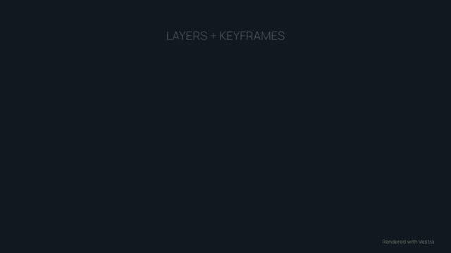

# Vestra

Vestra is a native video composition and rendering engine with a Python
authoring API and a Rust core. Render compositions through CPU or WGPU.



[Full demo](https://github.com/evgen2571/vestra/blob/main/examples/showcase/readme-demo/render.mp4)
· [Python source](https://github.com/evgen2571/vestra/blob/main/examples/showcase/readme-demo/main.py)
· [Asset credits](https://github.com/evgen2571/vestra/blob/main/examples/showcase/ASSETS.md)

## Quick start

With uv:

```bash
uv add vestra
uv run python example.py
```

Or with pip:

```bash
python -m pip install vestra
python example.py
```

Install **ffmpeg and ffprobe** on `PATH` before rendering.
Save this as `example.py` to create `output.mp4`:

```python
from vestra import Project
from vestra.sources import Color, Rectangle


project = Project(size=(640, 360), fps=30, duration=2)
project.root.add(Color("#171d20"), duration=2)

bar = project.root.add(Rectangle(width=240, height=8, fill="#a9c4aa"), duration=2)
bar.transform.scale.keyframe(0, (0.05, 1))
bar.transform.scale.keyframe(2, (1, 1))

project.render("output.mp4", backend="cpu", overwrite=True)
```

## Features

- Images, video, shapes, text and particles.
- Keyframes, nested compositions, masks, effects and transitions.
- Audio mixing, fades, spectrum graphics and audio signals.
- Python authoring, Rust SDK and JSON CLI with validation and render progress.

## Examples

Browse the [showcases](https://github.com/evgen2571/vestra/blob/main/examples/showcase/README.md)
for rendered videos and source, or the [reference examples](https://github.com/evgen2571/vestra/blob/main/examples/README.md)
for individual features.

## Documentation

[Python quickstart](https://github.com/evgen2571/vestra/blob/main/docs/getting-started/python-quickstart.md)
· [Docs index](https://github.com/evgen2571/vestra/blob/main/docs/index.md)
· [API reference](https://github.com/evgen2571/vestra/blob/main/docs/reference/python-api.md)
· [Contributing](https://github.com/evgen2571/vestra/blob/main/CONTRIBUTING.md)

## Development

```bash
nix develop
just check
```

See the contributing guide above and [testing](https://github.com/evgen2571/vestra/blob/main/docs/development/testing.md)
for setup and verification details.

## License

[MIT](https://github.com/evgen2571/vestra/blob/main/LICENSE).
See [third-party notices](https://github.com/evgen2571/vestra/blob/main/THIRD_PARTY_NOTICES.md)
and [asset licenses](https://github.com/evgen2571/vestra/blob/main/examples/showcase/ASSETS.md).
