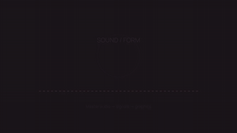

# Sound / form

[Watch / download the rendered video](render.mp4)



A twelve-second warm spectrum composition with a master-audio RMS signal,
smoothed reactive geometry, seeded particles and modest bloom. Spectrum2D uses
prepared audio frequency analysis; the halo and particle opacity use scalar signals.

From the checkout after `uv sync --locked --extra dev`:

```bash
uv run python examples/showcase/audio-visualizer/main.py
```

Output: `examples/output/audio-visualizer.mp4`, 1280×720, 30 fps, 12 seconds, CPU.
Pass `--smoke` for the full timeline at 320×180 and 6 fps, or `--output PATH`.
The original synth bed is generated using Python's standard library; no download
is required. [ASSETS](../ASSETS.md) records its CC0 dedication and the font license.
