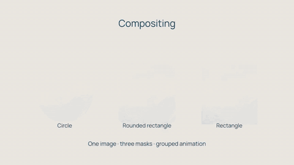

# Compose / reframe

[Watch / download the rendered video](render.mp4)



An eight-second architectural window made from nested shapes. A hidden layer
provides the moving alpha track matte; the group animates as one surface, and
modest directional blur/chromatic separation finish the scene.
A geometric owned mask clips the accent rule. Geometry and typography are restrained.

From the checkout after `uv sync --locked --extra dev`:

```bash
uv run python examples/showcase/compositing/main.py
```

Output: `examples/output/compositing.mp4`, 1280×720, 30 fps, 8 seconds, CPU.
Pass `--smoke` for the full timeline at 320×180 and 6 fps, or `--output PATH`.
The included OFL font is the only external asset; no downloads are needed.
See [ASSETS](../ASSETS.md).
