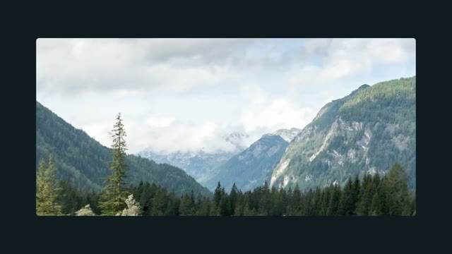

# README demo

[Watch / download the rendered video](render.mp4)



A restrained ten-second opening, photograph reveal, nested geometric composition,
and final title card. It uses shapes, file-backed text, an image, keyframes,
Saturation, an owned geometric mask, nesting and a Crossfade transition.

From the repository root after `uv sync --locked --extra dev`:

```bash
uv run python examples/showcase/readme-demo/main.py
```

Output: `examples/output/readme-demo.mp4`, 1280×720, 30 fps, 10 seconds, CPU.
The small font/photo assets are included; no downloads are needed. Their licenses
and reproduction instructions are in [ASSETS](../ASSETS.md).

For a faster full-timeline check:

```bash
uv run python examples/showcase/readme-demo/main.py --smoke
```

This writes the same destination at 320×180 and 6 fps. Pass `--output PATH` to
keep a separate preview. All paths resolve from the example files, so the source
needs no edits when the checkout moves. The composition is silent.
