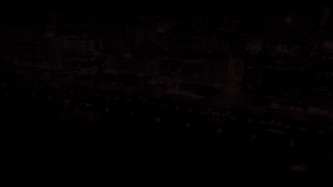

# Video editing

[Watch / download the rendered video](render.mp4)



A fourteen-second video editing example: three real footage selections, slow reframing,
two dissolves, muted saturation/vignette, a grouped title, attribution and an
original synth bed with fades. This demonstrates media → timeline → effects → output.

From the checkout after `uv sync --locked --extra dev`:

```bash
uv run python examples/showcase/real-media-edit/main.py
```

Output: `examples/output/real-media-edit.mp4`, 1280×720, 30 fps, 14 seconds, CPU.
Pass `--smoke` for the complete timeline at 320×180 and 6 fps, or `--output PATH`.
The three five-second selections and soundtrack are bundled, so the checkout
renders without a download. `prepare-assets.py` can reproduce them from the
verified original (about 61.5 MiB), which stays in an ignored local cache.

Footage is **CC BY 3.0** and the replacement audio is **CC0**. Keep the attribution
and accompanying source/license links when sharing output. Read [ASSETS](../ASSETS.md)
for verified provenance, processing and redistribution requirements.
